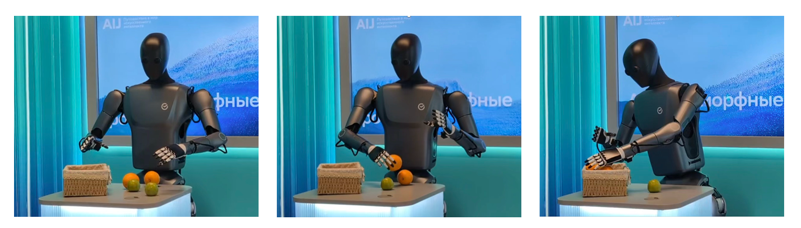

<div align="center">

# Green-VLA

### Staged Vision-Language-Action Model for Generalist Robots

<br/>

**Sber Robotics Center &middot; Manipulation Team**

<br/>

[**Paper**](https://arxiv.org/abs/2602.00919)&ensp;|&ensp;[**Project Page**](https://greenvla.github.io/)&ensp;|&ensp;[**Models**](#-models)&ensp;|&ensp;[**Quick Start**](#-quick-start)&ensp;|&ensp;[**Benchmarks**](#-benchmarks)

<br/>

[](https://arxiv.org/abs/2602.00919)
[](https://huggingface.co/collections/SberRoboticsCenter/greenvla)
[](https://python.org)
[](https://pytorch.org)

<br/>

<!-- TODO: add a hero image or GIF here -->
   

</div>

<br/>

---

## Overview

**Green-VLA** is a ~4B-parameter Vision-Language-Action model built on a staged curriculum:

| Stage | Name | Purpose |
|:---:|---|---|
| **Base** | Multi-Embodiment Pretrained Model | VLM backbone with multimodal grounding, trained on 3,000+ hours of demonstrations |
| **R1** | Embodiment-Specific Adaptation | Supervised fine-tuning for target robot |
| **R2** | RL Policy Alignment | Trajectory optimization beyond behavior cloning |


For full details, see our [paper](https://arxiv.org/abs/2602.00919) and [project page](https://greenvla.github.io/).

<br/>

---

## Models

We release model checkpoints spanning base pretrained models and embodiment-adapted variants:

| Model | Stage | Params | Description | Link |
|-------|:-----:|:------:|-------------|:----:|
| **GreenVLA-2b-base** | Base | 2B | Base pretrained model (lightweight) | [Hub](https://huggingface.co/SberRoboticsCenter/GreenVLA-2b-base) |
| **GreenVLA-5b-base-stride-1** | Base | 5B | Base pretrained, action expert depth = VLM depth | [Hub](https://huggingface.co/SberRoboticsCenter/GreenVLA-5b-base-stride-1) |
| **GreenVLA-5b-base-stride-4** | Base | 5B | Base pretrained, action expert depth = VLM depth / 4 | [Hub](https://huggingface.co/SberRoboticsCenter/GreenVLA-5b-base-stride-4) |
| **GreenVLA-5b-stride-1-R1-bridge** | R1 | 5B | Fine-tuned on Bridge (WidowX) | [Hub](https://huggingface.co/SberRoboticsCenter/GreenVLA-5b-stride-1-R1-bridge) |
| **GreenVLA-5b-stride-1-R2-bridge** | R2 | 5B | RL-aligned on Bridge (WidowX) | [Hub](https://huggingface.co/SberRoboticsCenter/GreenVLA-5b-stride-1-R2-bridge) |
| **GreenVLA-5b-stride-4-R1-fractal** | R1 | 5B | Fine-tuned on Fractal (Google Robot) | [Hub](https://huggingface.co/SberRoboticsCenter/GreenVLA-5b-stride-4-R1-fractal) |
| **GreenVLA-5b-stride-1-R2-calvin** | R2 | 5B | RL-aligned on CALVIN | [Hub](https://huggingface.co/SberRoboticsCenter/GreenVLA-5b-stride-1-R2-calvin) |

> **Recommendation:** Start with **GreenVLA-5b-base-stride-1** for fine-tuning on your own embodiment, or use one of the R1/R2 checkpoints for direct evaluation.

### Choosing stride-1 vs stride-4 (5B base)

The 5B base is available in two action-expert variants: **stride-1** (action expert has the same number of layers as the VLM) and **stride-4** (action expert has 4× fewer layers). Use the following to decide:

| Criterion | Stride-1 | Stride-4 |
|----------|:--------:|:--------:|
| **Inference VRAM** | ~12.5 GB | ~11.1 GB |
| **Training batch size** (80 GB GPU, 3×448² images, `tokenizer_max_length=640`) | 5 | 6 |
| **Inference speed** (4B proxy, see below) | Slower | Faster |

**Inference time** (mean seconds per forward, 4B model; 5 warmup + 50 benchmark iterations):

| Compiled | Stride-1 | Stride-4 |
|:--------:|:--------:|:--------:|
| No | 0.273 s | 0.124 s |
| Yes | 0.181 s | 0.098 s |

- Prefer **stride-1** when you need maximum action capacity and have enough VRAM; use it for Bridge/CALVIN and when fine-tuning from scratch.
- Prefer **stride-4** when you are memory- or latency-bound; we release a Fractal R1 checkpoint in this variant.

<br/>

---

## Quick Start

### Installation

<details open>
<summary><b>Using uv (recommended)</b></summary>

```bash
git clone https://github.com/greenvla/GreenVLA.git
cd GreenVLA
uv sync
```

</details>

<details>
<summary><b>Using micromamba / conda</b></summary>

```bash
git clone https://github.com/greenvla/GreenVLA.git
cd GreenVLA

micromamba env create -n greenvla python=3.11
micromamba activate greenvla
pip install -e .
```

</details>

### Inference

Load a model and build the full inference pipeline in a single call:

```python
from lerobot.common.policies.factory import load_pretrained_policy

policy, input_transforms, output_transforms = load_pretrained_policy(
    "SberRoboticsCenter/GreenVLA-5b-base-stride-1",
    data_config_name="bridge",
)
```

This downloads the config, weights, and normalization statistics from the Hub automatically. It also works with local checkpoint paths:

```python
policy, input_transforms, output_transforms = load_pretrained_policy(
    "/path/to/checkpoint",
    data_config_name="bridge",
    config_overrides={"device": "cuda:0"},
)
```

See [docs/INFERENCE.md](docs/INFERENCE.md) for the full inference guide and example notebooks.

<br/>

---

## Benchmarks

### SimplerEnv &mdash; Google Robot (Fractal)

| Model | Visual Matching | Variant Agg. | **Overall** |
|-------|:---:|:---:|:---:|
| [**Green-VLA stride-4 R1**](https://huggingface.co/SberRoboticsCenter/GreenVLA-5b-stride-4-R1-fractal) | **77.0%** | **66.7%** | **71.8%** |

### SimplerEnv &mdash; WidowX (Bridge)

| Model | Partial Avg | **Entire Avg** |
|-------|:---:|:---:|
| [**Green-VLA stride-1 R2**](https://huggingface.co/SberRoboticsCenter/GreenVLA-5b-stride-1-R2-bridge) | **94.5%** | **80.5%** |
| [Green-VLA stride-1 R1](https://huggingface.co/SberRoboticsCenter/GreenVLA-5b-stride-1-R1-bridge) | 89.6% | 72.9% |

### CALVIN

| Model | **Avg Chain Length** |
|-------|:---:|
| [**Green-VLA stride-1 R2**](https://huggingface.co/SberRoboticsCenter/GreenVLA-5b-stride-1-R2-calvin) | **4.57** |


<br/>

---

## Documentation

| Guide | Description |
|-------|-------------|
| [Fine-Tuning](docs/FINE_TUNING.md) | Dataset statistics, configuration, training |
| [Inference](docs/INFERENCE.md) | Loading models, running inference, example notebooks |

<br/>

---

## Project Structure

```
GreenVLA/
├── assets/                  # Images, videos, and other media
├── docs/                    # Detailed guides
│   ├── FINE_TUNING.md       # Fine-tuning guide
│   └── INFERENCE.md         # Inference guide & examples
├── lerobot/
│   ├── conf/                # Hydra configs (policy, dataset, training)
│   ├── common/
│   │   └── policies/        # Policy implementations
│   │       └── greenvla_policy/
│   └── scripts/             # Training & inference scripts
└── examples/                # Inference examples & notebooks
```

<br/>

---

## Citation

If you find Green-VLA useful, please cite our paper:

```bibtex
@misc{apanasevich2026greenvlastagedvisionlanguageactionmodel,
    title   = {Green-VLA: Staged Vision-Language-Action Model for Generalist Robots},
    author  = {I. Apanasevich and M. Artemyev and R. Babakyan and P. Fedotova and
               D. Grankin and E. Kupryashin and A. Misailidi and D. Nerus and
               A. Nutalapati and G. Sidorov and I. Efremov and M. Gerasyov and
               D. Pikurov and Y. Senchenko and S. Davidenko and D. Kulikov and
               M. Sultankin and K. Askarbek and O. Shamanin and D. Statovoy and
               E. Zalyaev and I. Zorin and A. Letkin and E. Rusakov and
               A. Silchenko and V. Vorobyov and S. Sobolnikov and A. Postnikov},
    year    = {2026},
    eprint  = {2602.00919},
    archivePrefix = {arXiv},
    primaryClass  = {cs.RO},
    url     = {https://arxiv.org/abs/2602.00919},
}
```

## ⚠ Acknowledgements

This project draws inspiration and references from several notable open-source initiatives, including:

- [LeRobot](https://github.com/huggingface/lerobot)
- [OpenPI](https://github.com/Physical-Intelligence/openpi)
- [StarVLA](https://github.com/starVLA/starVLA)

The codebase was originally forked from [LeRobot](https://github.com/huggingface/lerobot).

<br/>

<div align="center">

&copy; 2026 Sber Robotics Center &middot; Manipulation Team

</div>
